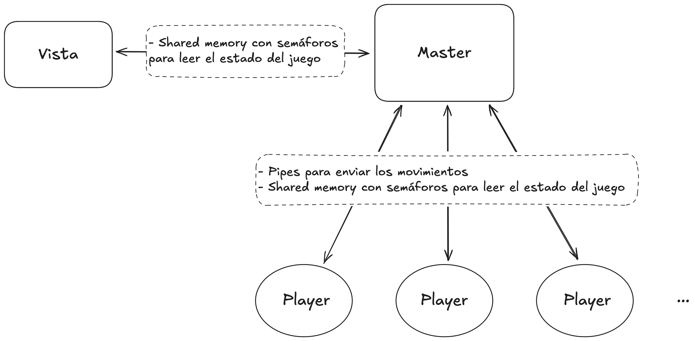

# TP1-SO
## Introducción
El objetivo del trabajo consiste en desarrollar 3 programas parte de un juego cuyos procesos se comuniquen entre sí vía shared memory y pipes siguiendo este esquema:


A grandes rasgos, el proceso Master es quien controla la shared memory y se encarga de gestionar el juego, la Vista se encarga de mostrar el estado del juego en la pantalla, y los Players juegan pidiéndole al Master moverse.

## Instrucciones de compilación y ejecución
Levantar el proyecto es muy sencillo, basta con clonar el repositorio, levantar el contenedor (hay un script que se encarga), hacer el make y correr el master:

```bash
# fuera del contenedor
git clone git@github.com:LyT-Labs/TP1-SO.git
cd TP1-SO
./docker_run.sh  # -> ojo que no exista otro contenedor de nombre "/TP1_SO" en el sistema
./docker_ssh.sh

# dentro del contenedor
make
./play -m    # Correr ./play --help para ver las opciones 

# para correr manualmente, usar ./master
# los args son los que especifica el enunciado del TP, ej:
./master -v view -p player player
```
### Scripts
- Para los contenedores se hicieron los scripts `docker_run.sh` para levantar el contenedor y `docker_ssh.sh` para iniciar una terminal en el mismo.
- Para facilitar correr el máster, se creó el script `play`, que automáticamente corre ChompChamps o el máster con la cantidad de players indicados (usa el binario player para todos), con o sin vista, y con los parámetros opcionales que se desee.
  - Para información sobre su uso, correr `./play –help`.


